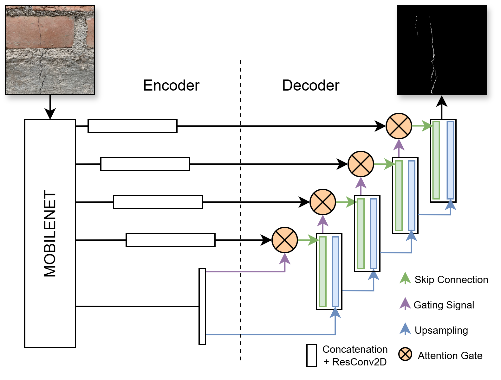

# Codes_Masonry
This repository contains the main codes used for crack semantic segmentation, brick type classification, and detection of spalling regions.

## Table of Contents
- [Description](#description)
- [Models](#models)
- [How to Run the Models](#how-to-run-the-models)
- [Dataset](#dataset)
- [References](#references)

## Description
This repository contains the main architectures developed for multiple computer vision tasks, including scale frame detection using HSV filters, semantic segmentation, skeletonization, brick type classification, and spalling region detection. It also includes the original dataset used for training and evaluation.

## Models
The proposed model for the crack semantic segmentation task is based on the UNet MobileNet architecture. Attention modules and residual blocks were incorporated as enhancements, along with a reduction in the number of parameters and an input adaptation for 512×512 pixel images. This results in the model we call Attention Res UNet MobileNet.

In addition, the proposed algorithm for brick classification consists of two stages. The first involves preprocessing the 512×512 image before feeding it into the CNN model, which corresponds to the second stage.

The convolutional layers helped identify patterns, which was further enhanced through transfer learning.

## How to Run the Models

To run the code, you must have the training and validation images and masks ready. These should meet the orthogonality recommendations and have an approximate resolution of 5 pixels/mm for the crack semantic segmentation task. These characteristics are not required for the other tasks involving classification and bounding box detection.

The validation dataset for the brick type classification task undergoes pixel reduction through resizing and grayscale conversion, which helps decrease information load while maintaining good accuracy in predicting the corresponding class.

For spalling region detection, by providing high-quality data, the YOLOv11 architecture successfully detected spalling in bricks, mortar, and confinement elements.

It is recommended to use Google Colab, separating the code blocks marked with “#----” into individual cells. If you want to test the pre-trained models for confined masonry with irregular surfaces, you can download the .h5 files and run them using the validation images.

## Dataset

The Dataset folder contains the data used for training and testing the models.
## References

El modelo propuesto para la tarea de segmentación surge apartir del modelo propuesto en el estudio de Dais et .al [1]. Asimismo se referencian otras fuentes que se usaron.  

1. D. Dais, İ. E. Bal, E. Smyrou, V. Sarhosis, *Automatic crack classification and segmentation on masonry surfaces using convolutional neural networks and transfer learning*, **Automation in Construction**, 125 (2021), 103606. [https://doi.org/10.1016/j.autcon.2021.103606](https://doi.org/10.1016/j.autcon.2021.103606)

2. O. Oktay, J. Schlemper, L. L. Folgoc, M. Lee, M. Heinrich, K. Misawa, K. Mori, S. McDonagh, N. Y. Hammerla, B. Kainz, B. Glocker, D. Rueckert, *Attention U-Net: Learning where to look for the pancreas*, **arXiv preprint**, arXiv:1804.03999 (2018). [https://arxiv.org/abs/1804.03999](https://arxiv.org/abs/1804.03999)

3. K. He, X. Zhang, S. Ren, J. Sun, *Deep residual learning for image recognition*, in: **Proceedings of the IEEE Conference on Computer Vision and Pattern Recognition (CVPR)**, 2016, pp. 770–778.

